# sell it here!

Community&#39;s best choice in buy and sell

## Table of Content

Project Overview

Functional Requirements – Update

Project Design

Wireframe

## Project Overview

Our team has come up with a web application that will facilitate the buying and selling of items in a specific community. The purpose of our project is to help potential users to advertise and generate earnings from selling their products. Moreover, connecting people within the community is also one of our concern that is why every product will be sorted according to their location and will be sold only within the area.

Strictly, users should create their account in order for them to use our services. Without an account, a user can only browse in our application.  This is to ensure that they are legitimate, for them to be able to modify their account, and for us to gather their information that we need as a requirement for the system to run its processes. After account creation, they can sell their product in our application by uploading and filling up all necessary details of their item. On the other hand, our homepage would have advertisements and search feature where users can use to look for the items they are interested in. The item that they can buy would be determined by how much money they have in their account which they can load up in their profile page. Once an item is sold, the system will notify the seller and will update the buyer&#39;s account balance and the seller&#39;s item in the inventory.

## Functional Requirements - Update

Our system features are:

- Sign up

In order for the users to sell and buy items on our application, they must create an account.

- Login

After an account is created user should log in in order to buy or sell products.

- Edit profile

The user can edit their information, add funds to their account wallet, and upload the product they are selling.

- Add fund

The user will be asked for their account no, Card Verification Value, and the amount they want to load to their account.

- Sell item

This is located in their profile and will be used to upload the product they are selling. In order to complete this area, all required information field must be filled up.

- Transaction History

This section will show the user about their transactions history whether they bought or sold a product.

- Search item

A search bar will be placed on our homepage where the user can look up for the stuff they are interested in buying. All items that will be shown to the user will be sorted according to the community they are in. For instance, a user who searched for a product is from Toronto, only products whose sellers are from Toronto will show in the search result.

- Buy item

The search result will show the user the product that they are looking for together with the price, and the name of the seller. When the user has decided which one to buy, they will be redirected to product information. A buy button is placed under the product information and once clicked will redirect them to the confirmation page then show them the receipt and their updated account balance.

Modification:

In edit profile , we removed the add fund to their wallet event and the upload product they are selling. Instead, we made a new page for the user to upload their product so that the profile is just specifically for the user&#39;s information.

We removed inbox and added messaging. A message box is located in every product the user will view unless they are the one selling the product. Every user has a message tab where they can view all their messages. Messages that were bolded means it hasn&#39;t been viewed yet. They can reply to that message by clicking the message body.

Search bar is not located in homepage anymore. On our homepage, the users will see the most recent posted products and category links which when clicked will show all the active products of that category on a page where the search bar is located on the header part.

## Project Design
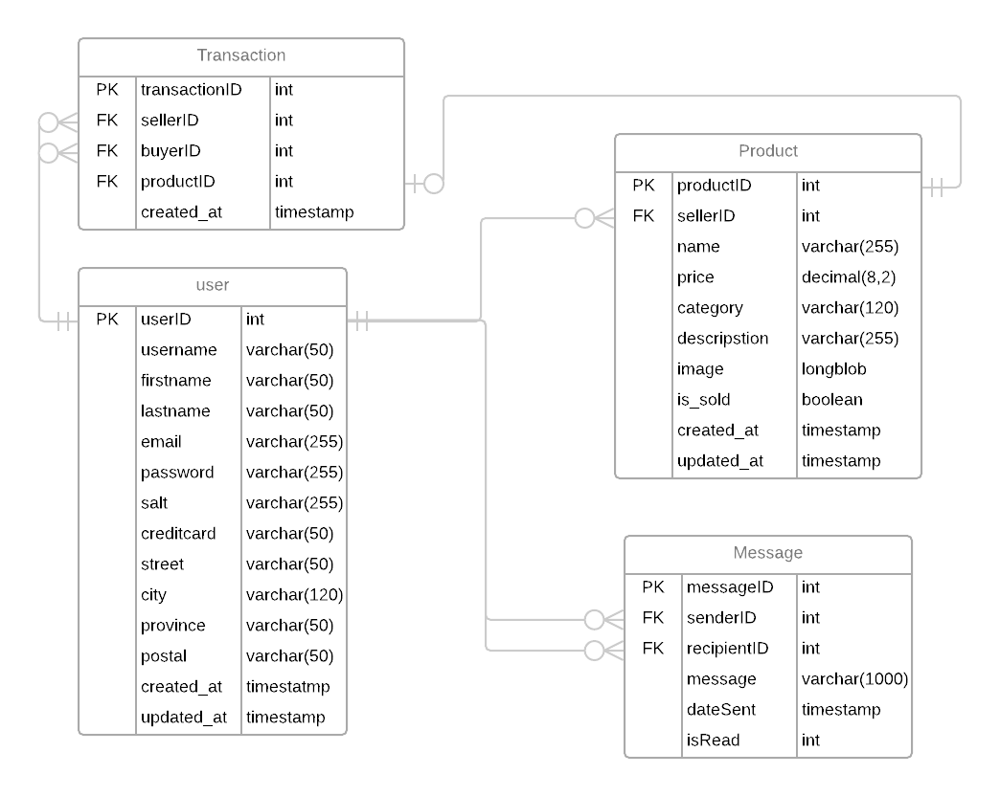
## Wireframe

1. **Home Page**
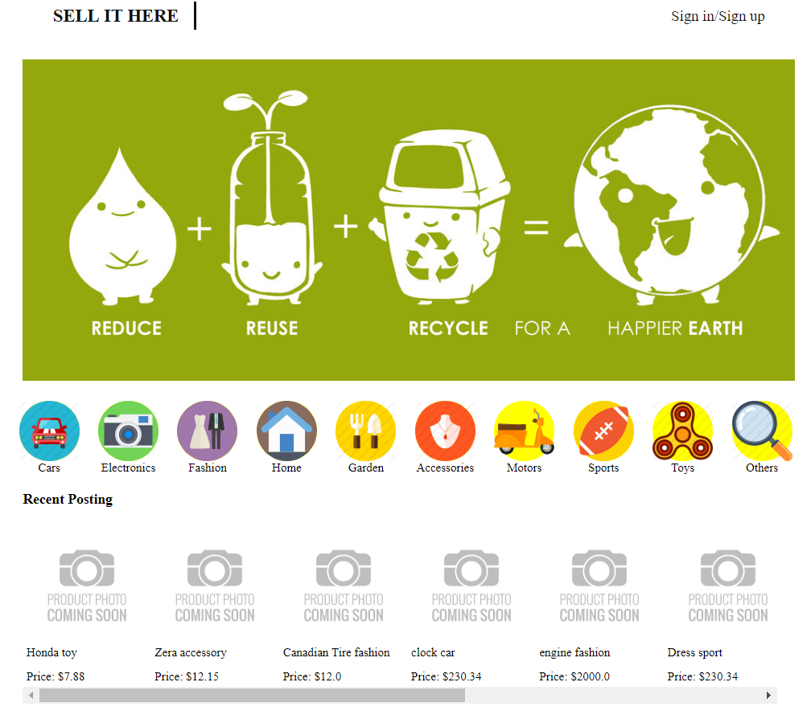
|
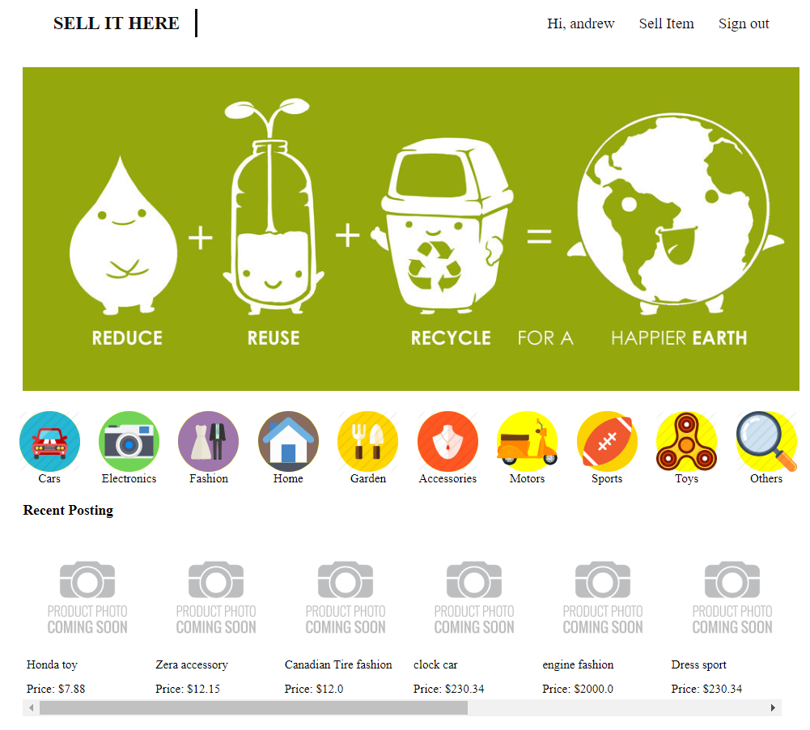

 | Contain link to Sign in/Signup Page         List of products categories the users can look up   List of 10 most recent products put up for sale     |
| --- | --- |
|
 =
 | When a user log ins, the nav displays link to the user profile, a link to create posts to sell product, and to sign out |

1. **Sign in/Sign up Page**
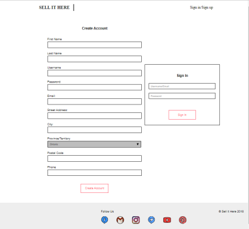

 |   the user gets accessed to this page by clicking on &quot;Sign in/Sign up&quot; at the top right of the page,  Use the left form to create new account and right form to sign in for an existing account |
| --- | --- |

1. **Product List Page**
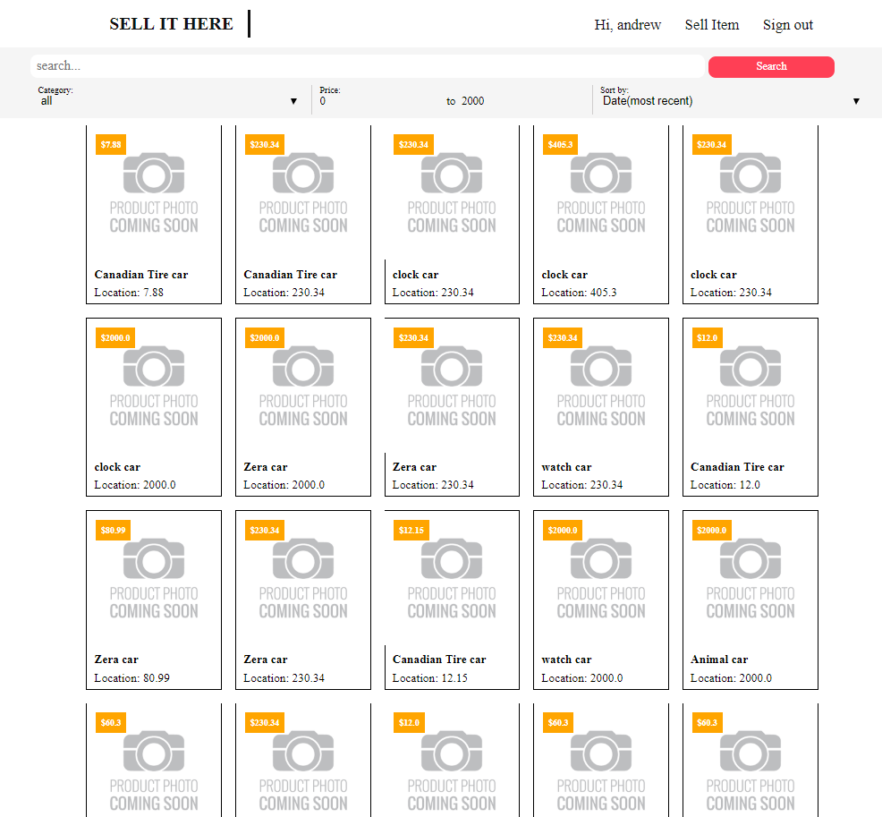
|

 |  Search bar allow to look for a specific type of item based on keywork, categories, price range, as well as how to sort the items      Select one of the products to view them in detail |
| --- | --- |

1. **Product Detail Page**

|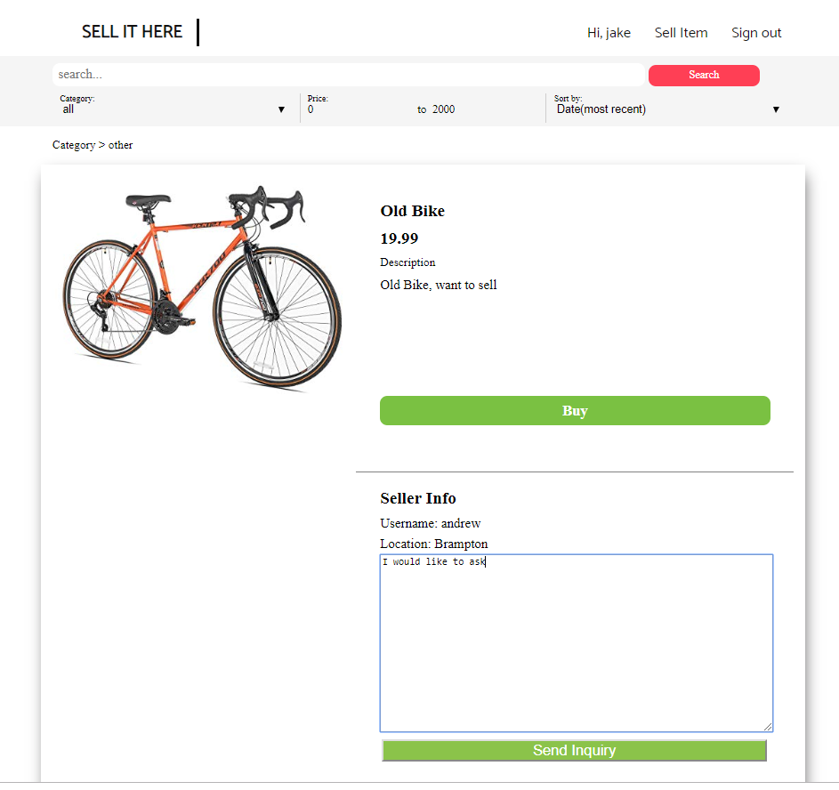

 | This is the view of the user who is not the seller of this product In this page, the user gets more information about the product like product description, seller name and the location he lives   The user can also send a message to the seller for any addition query about the product  |
| --- | --- |
|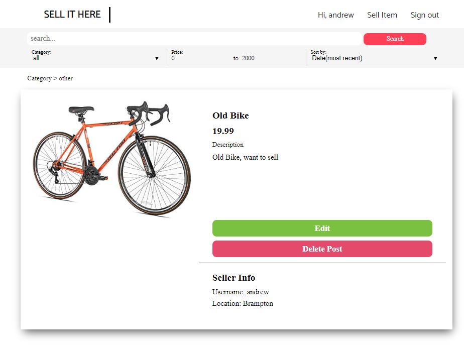

 | If the seller views his own product, he will have access to edit the product or take down the post if the product has not yet been sold |

1. **Buy Product Page**

|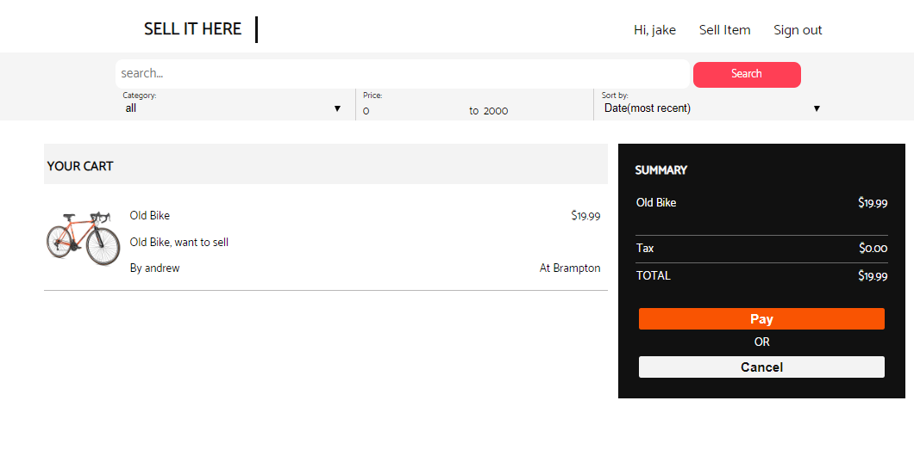

 | After a user clicked on &quot;Buy&quot; in the product detail page, if he hasn&#39;t logged in, he will be redirected to sign in page before he can process further. Else it will take him to this page to make confirmation about this purchase Click &quot;Pay&quot; to process with the purchaseClick &quot;Cancel&quot; to abort the transaction   |
| --- | --- |

1. **Sell Product Page**

|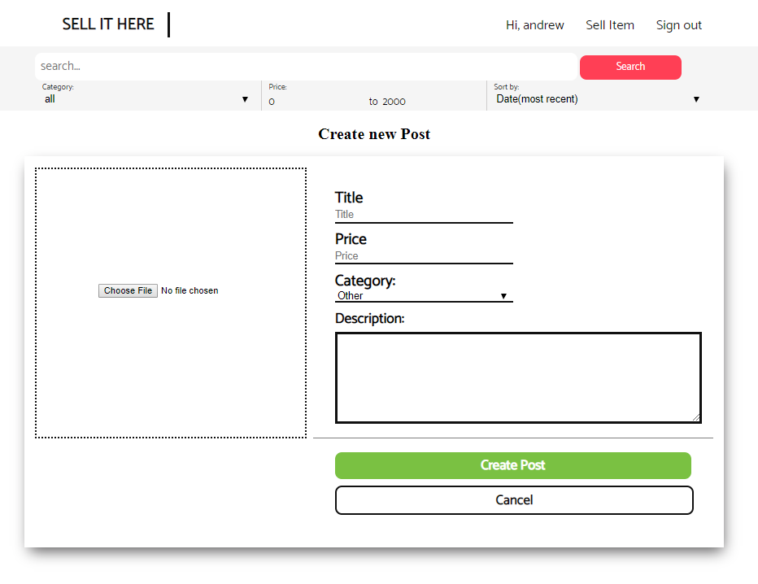

 | When a logged in user clicks on &quot;Sell Item&quot;, it will get him to this page where he can enter information about the product, he wants to sell      Click cancel if the user decides not to create the post |
| --- | --- |

1. **Edit Product Page**

|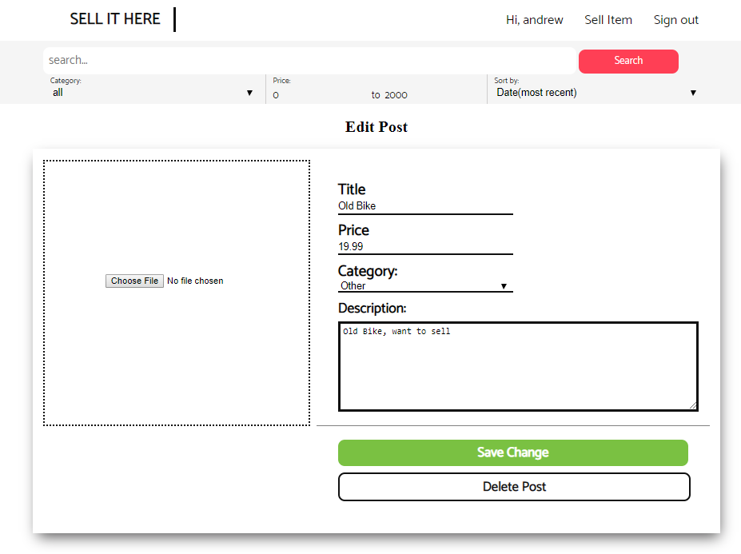
 | After created a post, the seller can edit his posts by clicking on Edit link in the product detail and that will transfer him to this page where he can modify the product information    The user can also delete the post if he wants to  |
| --- | --- |

1. **User Profile Page**

|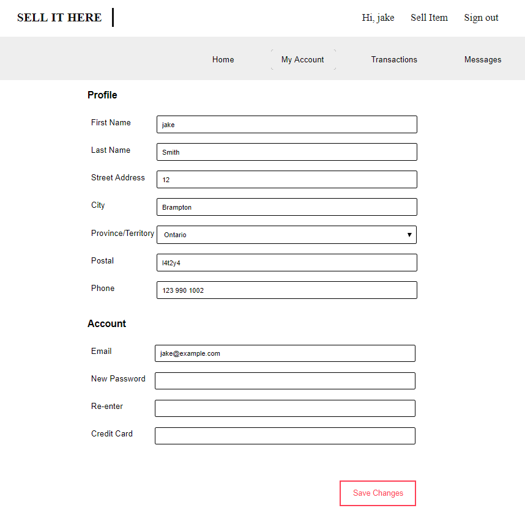

 |   This sub navbar contains links to the website home page, the user profile, transaction history and message history    when a logged in user clicks on his name in the top right navbar of the page, he gets transfer to his profile page where he can view the information he entered and edit them. |
| --- | --- |

1. **Transaction History Page**

|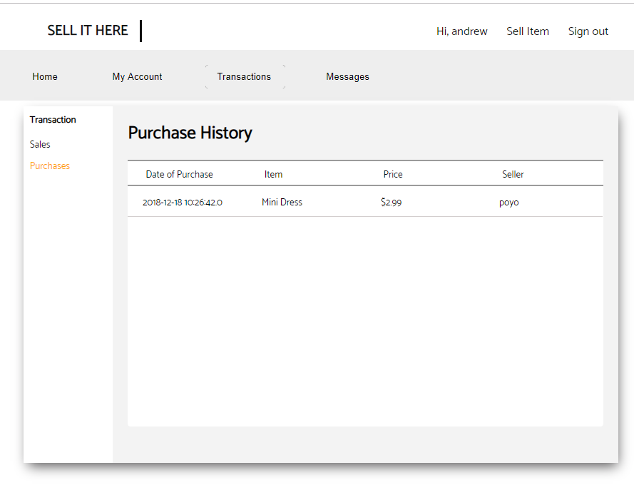

 |   When the logged in user click on &quot;Transaction&quot; in the sub nav, he can view what he has sold or buy |
| --- | --- |
|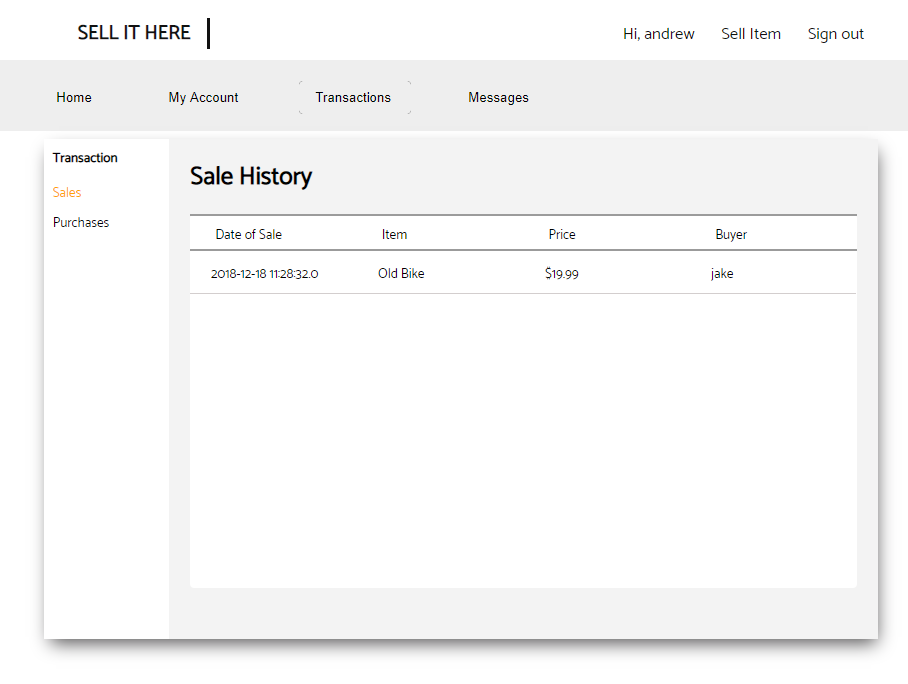

 |      Click &quot;Sales&quot; to view products he has sold Click &quot;Purchases&quot; to view products he has bought     |

1. **Message History Page**

|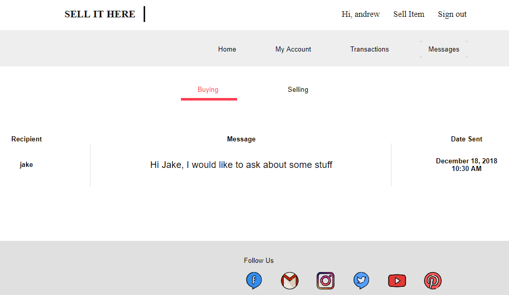
 |  Selecting &quot;Message&quot; in the sub nav, transfer the user to Message History page where he can view the messages he received and sent Click on the message to send reply |
| --- | --- |
|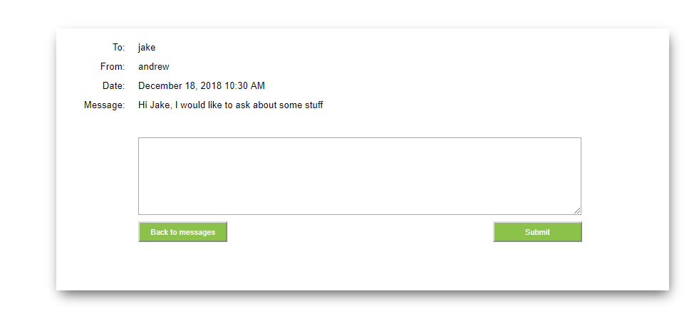

 |  After clicking on the message, he is transferred to this page to make a reply |

##
